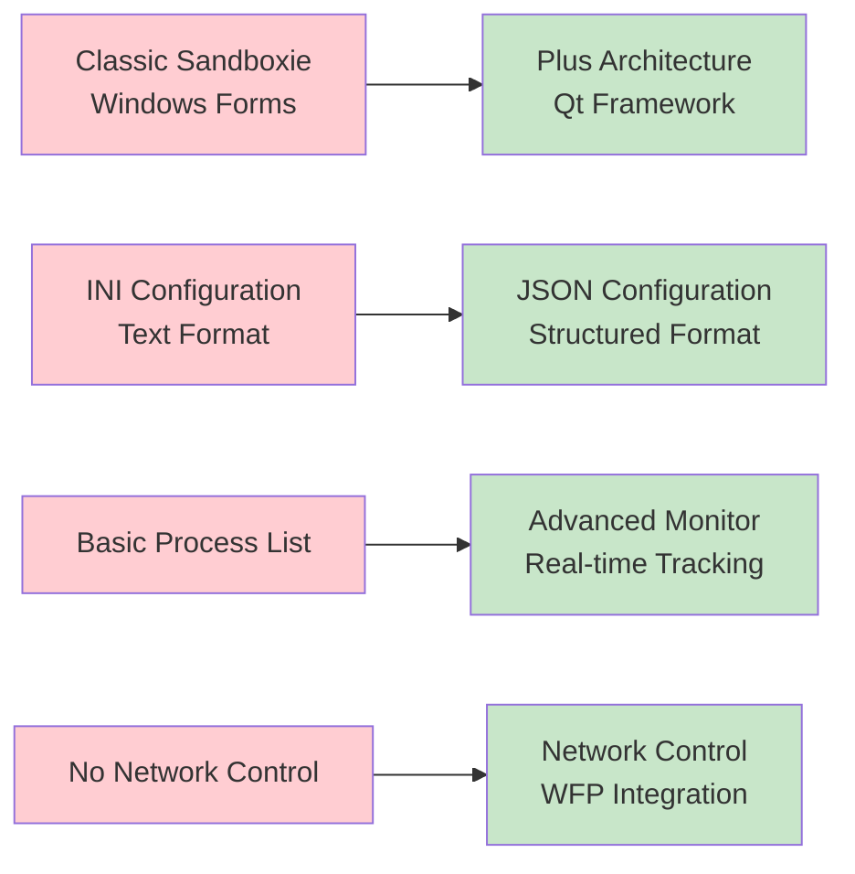
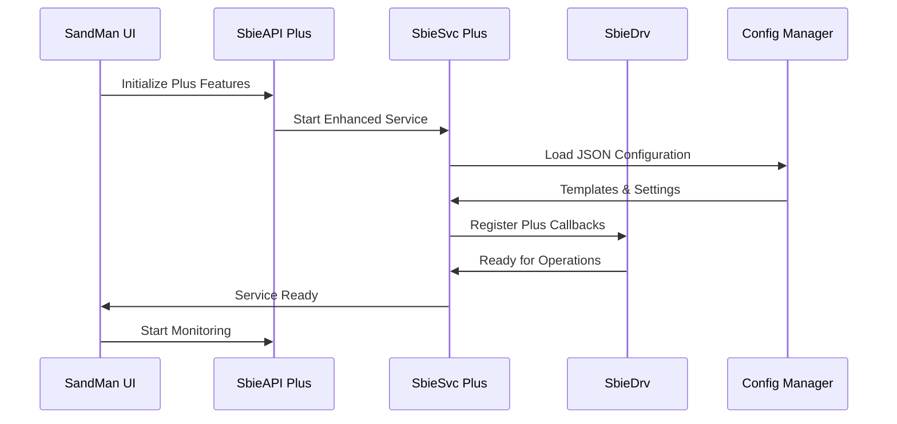
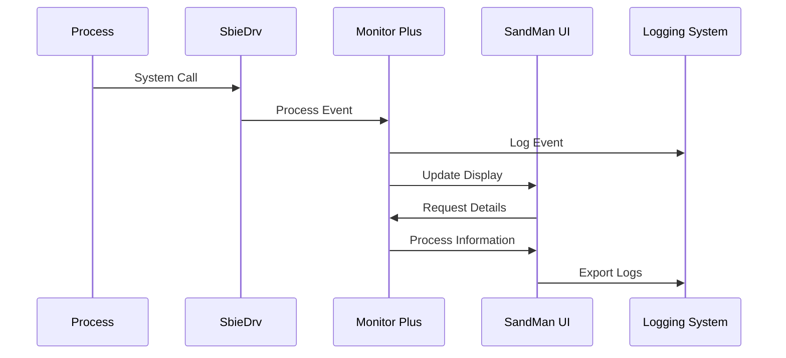
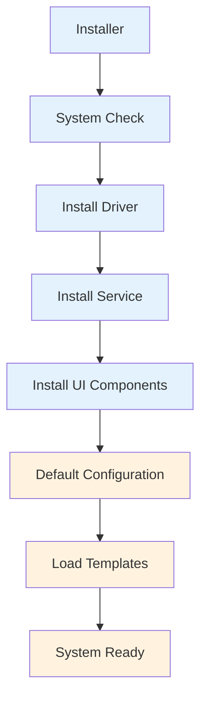

# Diagrama de Componentes - Sandboxie Plus

## Resumen de Arquitectura Plus

Sandboxie Plus extiende la arquitectura clásica de Sandboxie con componentes modernos de UI, gestión mejorada de sandboxes, y características avanzadas de monitoreo y configuración.

## Diagrama de Componentes Principales

```mermaid
graph TB
    %% UI Layer
    UI[SandMan UI<br/>Qt Application] --> API[SbieAPI<br/>Plus API Layer]
    API --> DRIVER[Kernel Driver<br/>SbieDrv.sys]
    
    %% Service Layer
    SVC[SbieSvc.exe<br/>Plus Service] --> DRIVER
    SVC --> PIPE[Named Pipes<br/>IPC Communication]
    
    %% Core Components
    DRIVER --> SYSCALL[Syscall Interception<br/>SSDT Hooking]
    DRIVER --> FILE[File System<br/>Minifilter]
    DRIVER --> REG[Registry<br/>Filter Callbacks]
    DRIVER --> IPC[IPC Object<br/>ObRegisterCallbacks]
    DRIVER --> NET[Network<br/>WFP Filtering]
    
    %% Injection Components
    DRIVER --> INJECT[Process Injection<br/>Pipeline]
    INJECT --> LOW[SbieLow.dll<br/>Low-level Hooking]
    INJECT --> DLL[SbieDll.dll<br/>User-mode Hooks]
    
    %% Plus-Specific Components
    UI --> PLUS[Plus Features]
    PLUS --> CONFIG[Configuration Manager<br/>JSON/XML Settings]
    PLUS --> MONITOR[Process Monitor<br/>Real-time Tracking]
    PLUS --> TEMPLATES[Templates Manager<br/>Predefined Rules]
    PLUS --> NETWORK[Network Monitor<br/>Connection Tracking]
    PLUS --> PRIVACY[Privacy Enhanced<br/>Data Protection]
    
    %% Storage & Configuration
    CONFIG --> STORAGE[Configuration Storage]
    STORAGE --> INI[Sandboxie.ini<br/>Classic Config]
    STORAGE --> JSON[Plus Settings<br/>JSON Format]
    STORAGE --> TEMPLATES_DB[Templates<br/>Database]
    
    %% External Integrations
    UI --> EXTERNAL[External Integrations]
    EXTERNAL --> AV[Antivirus<br/>Integration]
    EXTERNAL --> FIREWALL[Firewall<br/>Rules]
    EXTERNAL --> VIRT[Virtualization<br/>Support]
    
    %% Security Components
    DRIVER --> SECURITY[Security Layer]
    SECURITY --> TOKEN[Token Management<br/>Impersonation]
    SECURITY --> COMPAT[Compatibility<br/>Layer]
    SECURITY --> INTEGRITY[Integrity<br/>Checking]
    
    %% Monitoring & Logging
    MONITOR --> LOGS[Logging System]
    LOGS --> EVENT[Windows Event Log]
    LOGS --> DEBUG[Debug Output]
    LOGS --> FILE_LOG[Log Files]
    
    %% Network Stack
    NET --> WFP[Windows Filtering Platform]
    WFP --> FIREWALL_RULES[Firewall Rules]
    WFP --> DNS_FILTER[DNS Filtering]
    WFP --> APP_BLOCK[Application Blocking]
    
    %% Process Management
    INJECT --> PROCESS_MGR[Process Manager]
    PROCESS_MGR --> FORCED[Forced Programs]
    PROCESS_MGR --> AUTO_RUN[Auto Start]
    PROCESS_MGR --> MONITOR_PROG[Program Monitoring]
    
    %% File System Extensions
    FILE --> VFS[Virtual File System]
    VFS --> COPY_ON_WRITE[Copy-on-Write]
    VFS --> SNAPSHOTS[Snapshots Manager]
    VFS --> RECOVERY[File Recovery]
    
    %% Registry Extensions
    REG --> REG_VIRT[Virtual Registry]
    REG_VIRT --> REG_KEYS[Key Redirection]
    REG_VIRT --> REG_BACKUP[Registry Backup]
    REG_VIRT --> REG_RESTORE[Registry Restore]
    
    %% IPC Extensions
    IPC --> IPC_FILTER[IPC Filtering]
    IPC_FILTER --> HANDLE_FILTER[Handle Filtering]
    IPC_FILTER --> COM_FILTER[COM Object Filter]
    IPC_FILTER --> NAMED_PIPES[Named Pipe Filter]
    
    classDef uiLayer fill:#e1f5fe
    classDef serviceLayer fill:#f3e5f5
    classDef kernelLayer fill:#e8f5e8
    classDef plusLayer fill:#fff3e0
    classDef securityLayer fill:#fce4ec
    classDef storageLayer fill:#f1f8e9
    classDef networkLayer fill:#e0f2f1
    classDef monitorLayer fill:#f9fbe7
    
    class UI,API uiLayer
    class SVC,PIPE serviceLayer
    class DRIVER,SYSCALL,FILE,REG,IPC,NET kernelLayer
    class PLUS,CONFIG,MONITOR,TEMPLATES,NETWORK,PRIVACY plusLayer
    class SECURITY,TOKEN,COMPAT,INTEGRITY securityLayer
    class STORAGE,INI,JSON,TEMPLATES_DB storageLayer
    class WFP,FIREWALL_RULES,DNS_FILTER,APP_BLOCK networkLayer
    class LOGS,EVENT,DEBUG,FILE_LOG monitorLayer
```



## Componentes Plus Específicos

### 1. SandMan UI (Qt Application)
- **Interfaz Moderna**: Reemplaza la UI clásica con interfaz Qt moderna
- **Gestión Visual**: Arrastrar/soltar para configuración de sandboxes
- **Monitoreo en Tiempo Real**: Vista de procesos activos y recursos
- **Configuración Avanzada**: Editor de templates y reglas complejas

### 2. Configuration Manager
- **Formato JSON**: Configuración en formato JSON además del INI clásico
- **Templates System**: Plantillas predefinidas para aplicaciones comunes
- **Profile Management**: Múltiples perfiles de configuración
- **Import/Export**: Backup y restauración de configuraciones

### 3. Process Monitor
- **Real-time Tracking**: Monitoreo de procesos en tiempo real
- **Resource Usage**: Uso de CPU, memoria, y recursos de red
- **Dependency Tree**: Árbol de dependencias de procesos
- **Event Logging**: Registro detallado de eventos del sistema

### 4. Network Monitor
- **Connection Tracking**: Seguimiento de conexiones de red
- **DNS Filtering**: Filtrado de consultas DNS
- **Application Blocking**: Bloqueo a nivel de aplicación
- **Bandwidth Monitoring**: Monitoreo de ancho de banda

### 5. Privacy Enhanced Features
- **Data Protection**: Protección contra filtración de datos
- **Trace Cleanup**: Limpieza de huellas del sistema
- **Secure Delete**: Eliminación segura de archivos temporales
- **Browser Isolation**: Aislamiento mejorado para navegadores

## Integración con Arquitectura Clásica

### Mapeo de Componentes

| Componente Plus | Equivalente Clásico | Extensiones |
|-----------------|-------------------|-------------|
| SandMan UI | Sandboxie Control | Qt moderno, monitoreo real-time |
| Configuration Manager | Sandboxie.ini | JSON, templates, perfiles |
| Process Monitor | Process List | Árbol de dependencias, recursos |
| Network Monitor | No existía | WFP integration, DNS filtering |
| Privacy Features | No existía | Secure delete, trace cleanup |

### Compatibilidad Backward



## Flujo de Datos Plus

### 1. Inicialización del Sistema Plus



### 2. Flujo de Monitoreo Plus



## Características Técnicas Plus

### 1. Framework Qt
- **Cross-platform**: Soporte multiplataforma extendido
- **Modern UI**: Interfaz moderna con temas personalizables
- **Performance**: Mejor rendimiento de renderizado
- **Accessibility**: Mejor soporte de accesibilidad

### 2. JSON Configuration
- **Structured Data**: Datos estructurados y validados
- **Schema Validation**: Validación de esquemas de configuración
- **Version Control**: Control de versiones de configuración
- **API Integration**: Mejor integración con APIs externas

### 3. WFP Integration
- **Kernel-level Filtering**: Filtrado a nivel de kernel
- **Performance**: Alto rendimiento en filtrado de red
- **Flexibility**: Reglas de filtrado complejas
- **Compatibility**: Compatible con firewalls existentes

### 4. Advanced Monitoring
- **Real-time Updates**: Actualizaciones en tiempo real
- **Historical Data**: Datos históricos y tendencias
- **Alert System**: Sistema de alertas configurable
- **Export Capabilities**: Exportación a múltiples formatos

## Deployment y Distribución

### 1. Package Structure
```
SandboxiePlus/
├── SandMan.exe                 # Qt UI Application
├── SbieSvc.exe                 # Enhanced Service
├── SbieDrv.sys                 # Kernel Driver
├── SbieDll.dll                 # User-mode DLL
├── SbieLow.dll                 # Low-level Injection
├── Templates/                  # Configuration Templates
├── Languages/                  # Localization Files
├── Config/                     # Default Configurations
└── Resources/                  # UI Resources
```

### 2. Installation Flow


## Roadmap de Características Plus

### Versiones Futuras Planificadas
- **Cloud Integration**: Sincronización en la nube de configuraciones
- **Machine Learning**: Detección de comportamiento anómalo
- **Container Integration**: Integración con contenedores Docker
- **Enterprise Features**: Gestión centralizada empresarial
- **Mobile Support**: Soporte para plataformas móviles

Este diagrama muestra cómo Sandboxie Plus extiende la arquitectura clásica manteniendo compatibilidad mientras agrega características modernas de monitoreo, configuración avanzada, y gestión mejorada de sandboxes.
